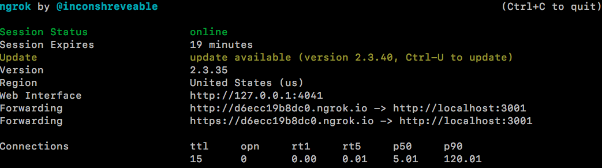
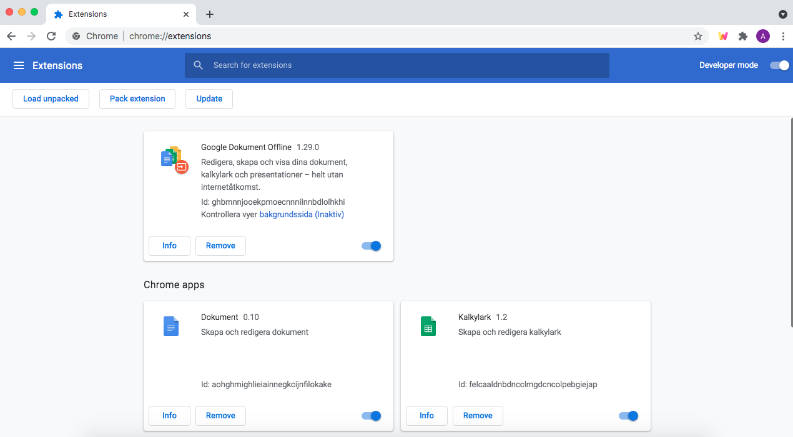
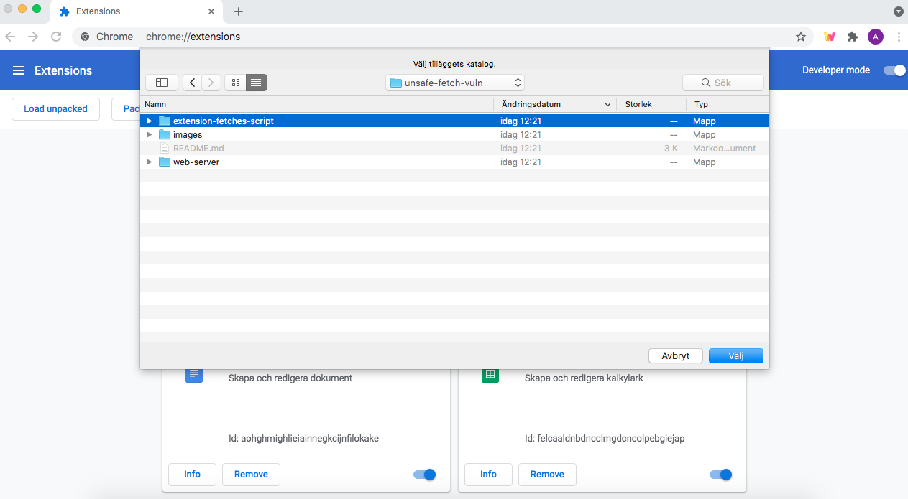
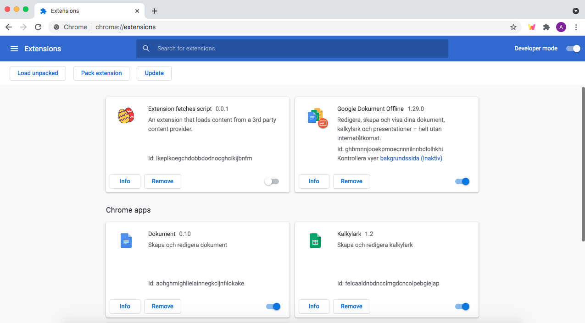

# Securing Chrome-extensions

TODO: Write about the repo here, and link to report.

## How to make web server externally accessible with `ngrok`

To make the web server externally accessible, install [ngrok](https://ngrok.com/) and execute:

```
> ngrok http 3001
```

(replacing '3001' with the port number of your server).

Then, look at the *forwarding* field in the `ngrok` output. This is the URL that you can use to access the server. As an example, this URL would be `https://d6ecc19b8dc0.ngrok.io` based on the image below:



## How to load extensions into your browser locally

To load an extension into your browser locally for testing, go to the **Extensions** view in Chrome (available at: chrome://extensions/). In the upper right corner, toggle "Developer Mode" to enable developer features. You should get three new options, as in the image below:



Choose **Load unpacked**, and select the extension's folder in the popup:



If everything worked, you should now be able to see the extension among your other extensions:

