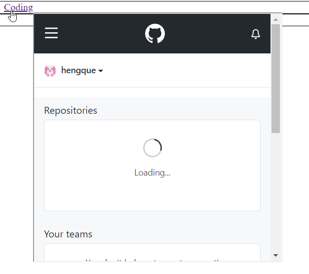
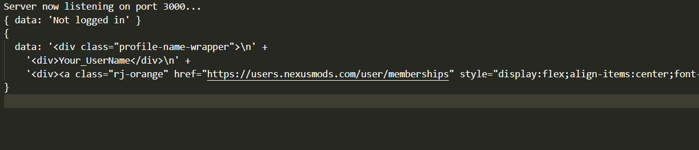

# Same Origin Policy bypass vulnerability

## Brief theory
We have an extension that (kind of) creates previews of websites when you mouse over links, like on Wikipedia. This extension also exposes an API that lets the visited websites choose to inspect the content that would appear in the preview and decide if a preview is allowed to be shown or not.

The problem with this extension is that by allowing the website to inspect the content we breach the [Same Origin Policy (SOP)](https://developer.mozilla.org/en-US/docs/Web/Security/Same-origin_policy). We fetch content for a website based on the links it provides and then we allow it to read the response. This means that if the website contains a link to a website where we are logged in, it can read our private data from that site. 

Normally the SOP prevents websites from reading the response if they request data from arbitrary other sites; but extensions are exempt from the SOP so our vulnerable extension helps websites circumvent the SOP. 

## How to run

### Malicious website
As outlined in the [main README](https://github.com/andreaskth/securing-chrome-extensions/tree/main#how-to-run-a-node-web-server), enter the website folder (here called 
*website-with-links*) and run `npm install`, and then run `node app.js` in the same folder to start the server. The default port used by the server is 3000; if you are using this port for something else you can change the port in `app.js` (don't forget to change the other occurrences of 3000 in this document as well).

When the site is up, you can visit `localhost:3000` to verify that you can see a couple of hyperlinks.  

### Extension
The vulnerable extension is located in *vulnerable-link-preview-extension*. Follow the instructions in the [main README](https://github.com/andreaskth/securing-chrome-extensions/tree/main#how-to-load-extensions-into-your-browser-locally) to load the extension into your browser locally. 

In the content script `content_script.js` change the `extensionID` variable on the first line to point to the ID of your extension. Then reload your extension in your browser by clicking the circular arrow on your extension in the extension management page.

## Results
Go to `localhost:3000` with the malicious website running. When you mouse over any of the links, a preview will be shown. The preview will be half-broken and it generates lots of error messages in the console. This is due to the fact that it proved non-trivial to get the extension "working" and so resources were allocated elsewhere since a well-functioning extension wasn't the goal of this project. For this reason, the previews from the extension appear to function even less on other sites.



Despite the link not even being visible, there is a link to https://www.nexusmods.com/ present on the site. This makes the extension fetch data from nexusmods. The malicious website says that it wants to inspect the data, which the extension forwards. If you are not logged in, the terminal where you run the malicious website will print `{ data: 'Not logged in' }`. If you are logged in (and assuming that https://www.nexusmods.com/ hasn't made any breaking changes since writing this), the terminal will have your username printed (along with some other content). Below is an image where nexusmods user "Your_UserName" has visited the malicious site once **before** logging in to nexusmods, and once **after** logging in.



## How to fix
It really is just a matter of not allowing the visited websites to read the content of the previews. Lines 56-58 in `content_script.js` of the vulnerable extension look like this:
```javascript
if (inspectIDs.has(current.id)) {
	postMessage({"id":current.id, "previewContent":content})
}
```

Instead of the `postMessage` you can just do nothing. This will mean that instead of allowing the website to inspect the content and make decisions, the API of the extension only allows the website to name the links it does not want previews for. But this is a small sacrifice in making the extension safe.

Lines 17-35 of `content_script.js` are a bit superfluous now. The purpose of these lines was to allow the website to add previews for links that it had said no to earlier, if it changed its mind after inspecting the content. That said, there's no harm in leaving them.
