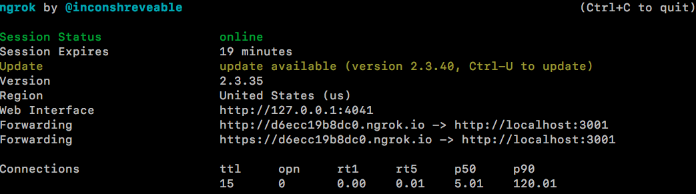
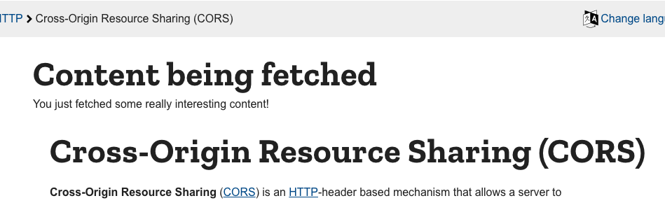
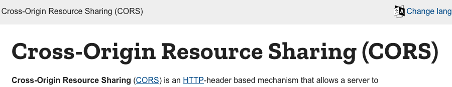
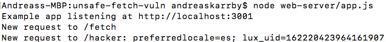

# Unsafe fetch vulnerability

## How to run

### Web server

In the `web-server` folder, run `npm install` to fetch required dependencies (this will create the `node_modules` folder, containing the dependencies). Then, run `node app.js` to start the server. If you are using port 3001 for something else, you can change the port in `app.js` (don't forget to change the other occurrences of 3001 in this README as well).

When the web server is running, you can visit `localhost:3001/hacker/foo` to verify that you see the following message in the terminal:  

```
New request to /hacker: foo
```

To make the web server externally accessible, install [ngrok](https://ngrok.com/) and execute:

```
> ngrok http 3001
```

Then look at the *forwarding* field in the `ngrok` output, and copy that URL to the `URL` variable in `app.js`. As an example, this URL would be `https://d6ecc19b8dc0.ngrok.io` based on the image below:



If you wish, you can also change the `DEBUG` and `HACKER_MODE` variables in `app.js`. The `DEBUG` flag will toggle `alert()`s for different stages of the attack, and the `HACKER_MODE` flag toggles whether or not the web server returns benign content or not.

### Extension

In the background script of the extension (`extension-fetches-script/background.js`), change the `contentURL` variable to contain the same URL as for the web server (in our example from above, `https://d6ecc19b8dc0.ngrok.io`). **NOTE** that you should only replace the *domain* part of the URL, not the entire path (i.e. keep the `/fetch` part).

Next, follow the instructions in the [main README](../README.md) to load the extension into your browser locally. When this is done, grab the extension's ID, and add it in the `extensionID` variable in the extension's content script (`extension-fetches-script/content.js`).

## Results
Now, when you navigate to any webpage containing an HTML element with `id=content` – such as [this page](https://developer.mozilla.org/en-US/docs/Web/HTTP/CORS) – the extension will insert content from your web server into the page. If `HACKER_MODE` is disabled, benign content is shown:



---

And when `HACKER_MODE` is enabled (emulating a malicious or compromised content provider), nothing is shown to the user:



---

But, in the terminal you will see the leaked cookies of the user:

